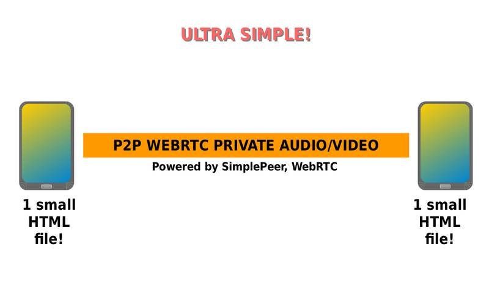
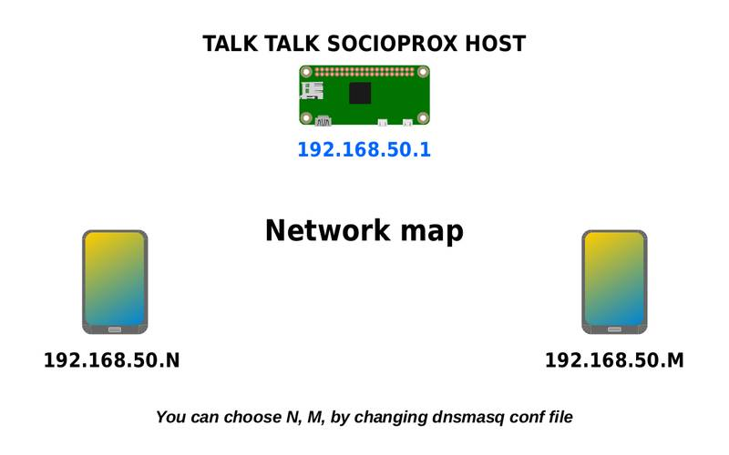
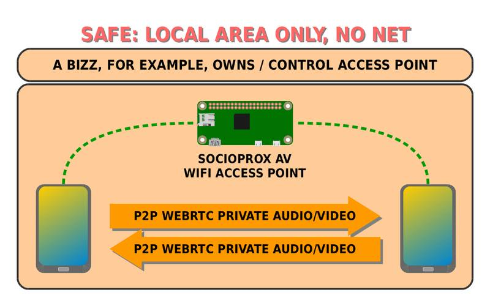
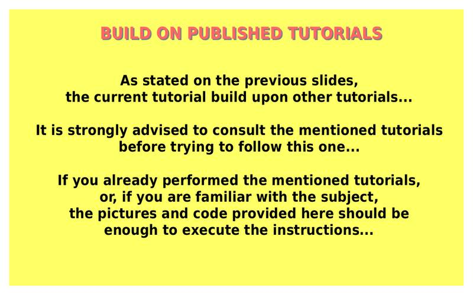

# Talk Talk SocioProx AV Tutorial
A "Walk-Talk" Tool for Social Proximity  
  
  

  
---

  
---

  
---

  
---

  
---

  
---

  
---

  
---

  
---

  
---

  
---

  
---

  
---

  
---

  
---

  
---

  
---

  
---

  
---

  
---

  
---
  
  
A Minimalist tutorial showing how to create a WiFi Access Point and provide host functions to connect 2 smart devices with bi-directional WebRTC Audio/Video, using SimplePeer Library.  
  
These are the very basic components, from here, there are many more features/function that can be added to perform useful tasks in many situations...
  
Routing to the Internet is optional, but here the goal is NOT to have Internet access, instead to allow the creation of a kind of "private link", enabling people to stablish audio/video link via WiFi, for short physical distances, helping them to avoid unnecessary close physical proximity...  
  
Links to the tutorials that the current tuto was based (use same code/instructions):  
https://github.com/t2age/wl-p2p-wifi  
  
https://github.com/t2age/wl-p2p-av  
  
  
**Use scenarious:**  
  
a) Perhaps a doctor can reduce 50% of close contact with a patient, during a consultation, using an APP based on this idea. The other 50% is task demand a close physical contact, so, in this case, the doctor is finishing his/her day with a 50% less exposure...
  
b) Co-Workers, that need to expose themselves to a journey of 8 hours a day in close physical proximity can use the APP to reduce 50% of such exposure time, so that only 4 hours a day is the lenght of the journey... reducing the total quantity of risk...  
  
c) Sales persons, that need to give attention to clients, can use such APP to reduce 50$ or more of exposure time, reducing the proximate contact to very few hours per day...  
  
  
Well, the tutorial is very simple, but it shows how can simple functions can serve the basis for tools that, even if it does not resolve the problem 100%, it may help to mitigate them, reducing risks to lower and lower levels, or maybe lower enough to allows for the continuation of activities in business, industry, commerce, social, etc...  
  
The KEY here is that, lots of things can be done, and even simpler tools can make difference...  
  
The other KEY is that, if we cannot have a 100% solution, why not a 50%, 30% or even 80%?  
  
Another KEY: the tutorial is just a core and basic idea, and, if we add features/functions, it may end up making a major percentual difference in the way that SEE the problem today...  
  
  
And, the tuto shows smart devices as the hardware, but in reality the idea works with SBCs and PCs as well, so we should thing in more wide sense in terms of tools, and not limit the application by just thinking of smart devices...  
  
In the end, trying to reduce risks may be a difficult "science", one that requires more sophisticated procedures and equipments, but, as I have said in previous post about P2P Social Proximity Platform, THERE ARE THINGS THAT WE CAN DO!  
  
If small things that we do, are not enough, the failures will point us in the right direction, and so we will try better things...  
  
Regards all,  
Valter
